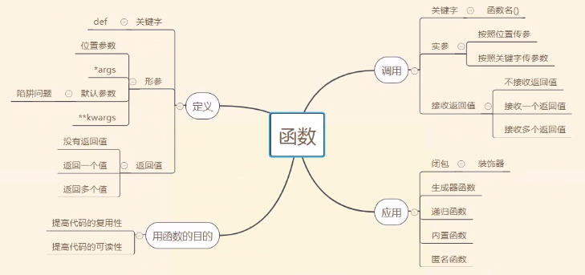

# 复习预习
## 函数
1. 函数的定义和调用
    ```
        def 函数名(形参):
            函数体
            return 返回值
    ```
    
    * 站在形参的角度上： 
        1. 位置参数
        2. *args
        3. 默认参数(陷阱)
        4. **kwargs
    * 站在形参的角度上： 
        1. 按照位置传
        2. 按照关键字传
    * 调用    
        * `函数名()`
    * 返回值(没有返回值，返回一个值，返回多个值)
        * 没有返回值不接受
        * 返回一个值有一个变量接收
        * 返回多个值用一个变量接收活用对应数目的值接收
    * 函数导图
        
        
    * 闭包函数改变
        * 内层函数引用着外层函数的变量

## 装饰器  -- 装饰器一定是闭包函数
1. 装饰器作用
    * 在不改变原来函数的调用方式的情况下，在这个函数的前后添加新的功能
2. 体现了开放封闭开发原则
    * 对拓展是开放的
    * 对修改是封闭的
3. 基础的装饰器
    ```
    from functools import wraps
    
    def wrapper(func):
        @wraps(func)    
        def inner(*args, **kwargs):
            '''函数前执行的代码'''
            ret = func(*args, **kwargs)
            '''函数前执行的代码'''
            return ret       
        return inner 
        
    使用：
    @wrapper
    def func():
        pass
    
    ```
4. 带参数的装饰器
    * @wrapper -> @wrapper(arg)
    * 三层嵌套函数
    ```
        def getwrapper(arg):
            def wrapper(func):
                @wraps(func)    
                def inner(*args, **kwargs):
                    '''函数前执行的代码'''
                    ret = func(*args, **kwargs)
                    '''函数前执行的代码'''
                    return ret       
                return inner 
            return wrapper
    ```
5. 多个装饰器装饰一个函数
    * 从上到下解释
    * 从下到上执行   

## 迭代器和生成器

## 内置函数

