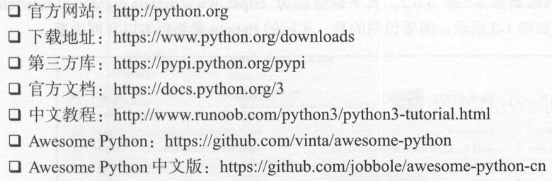

# python的安装

## python的相关网站

## windows下的Python安装
1. 使用anaconda安装，提供了Python的科学计算环境，自带了Python以及常用的库。
    * Anaconda安装，网址为 https://www.continuum.io/downloads
    * 安装包直接安装
        * Python网址 https://www.python.org/downloads/release/python-362/
        
## linux 下的安装

### 命令行安装
* CentOS、Red Hat
    * 如果是CentOS或者Red Hat版本，则使用yum命令安装即可。
    * sudo yum install -y https://centos7.iusconmmunity.org/ius-release.rpm
    * sudo yum updat
    * sudo yum install -y python35u python35u-libs python35u-devel python35u-pip

* ubuntu、Debian、Deepin
    * sudo apt-get install -y python3
    * sudo apt-get install -y python3-pip

