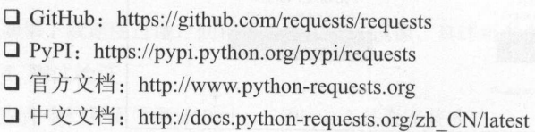

# 请求库的安装
* 爬虫可以简单分为几步骤：抓取页面、分析页面、存储数据。
* 在抓取页面的过程中，我们需要模拟浏览器向服务器发出请求，所以需要用到一些Python库来实现HTTP请求。
    > 需要用到的第三方库有   
    > * requests
    > * Selenium(si li ni e m)
    > * aiohttp
    
## request的安装
* 相关链接
    
* pip安装
    任何平台都可以通过这个工具安装
    
    pip3 install requests
    
## Selenium (si li ni e m)
* 自动化测试工具，利用它可以驱动浏览器执行特定的动作，如点击，下拉等等操作。对于JavaScript熏染的页面，这种抓取很有效

* 链接自己百度
* pip安装
    pip install selenium
    
    * chromeDriver的安装
        * 安装好Selenium之后，他只是一个自动化测试工具，需要配合浏览器来配合使用，我们介绍Chrome浏览器以及ChromeDriver驱动的配置
        * 下载网址 https://chromedriver.storage.googleapis.com/index.html
        * 代码测试
            ```
                from selenium import webdriver
                browser = webdriver.Chrome()
            ```
    * GeckoDriver的安装
        * 对于Firefox，也可以使用同样的暗示完成Selenium的对接，我们此时需要另外一个驱动程序GeckoDriver
        * 地址： https://github.com/mozilla/geckodriver/releases
        
## aiohttp
* 前面介绍的requests库是一个阻塞式的HTTP请求库，当我们发出一个请求之后，程序会一直等待服务器响应，知道得到响应后，程序才会进一步处理，这样的操作比较耗费时间，如果程序可以在这个等待的过程中做一些其他的事情，如请求的调度，响应的处理，那么爬取的息率一定会大大的提高
* aiohttp就是这样一个提供一部Web服务的库，从Python3.5开始Python加入了async/await关键字，使得回调函数的写法变得更加直观和人性化，aihttp的一部操作借助于async/await关键字的写法变得更加简洁，使用异步的方式进行数据爬取效率会高很多
* 安装方法
    pip3 install aiohttp
    
    推荐安装
    
    pip install cchardet(字符编码检测库)
    
    pip install aiodns
    
        
    
    
    
    
    
    
    
    
    
    
    
    
    
    
    
    
    
    
    
    
    
    
    
    
    
    
    
    
    
    
    
    
    
    
    
    
    
    
    
    
    
    
    
    
    