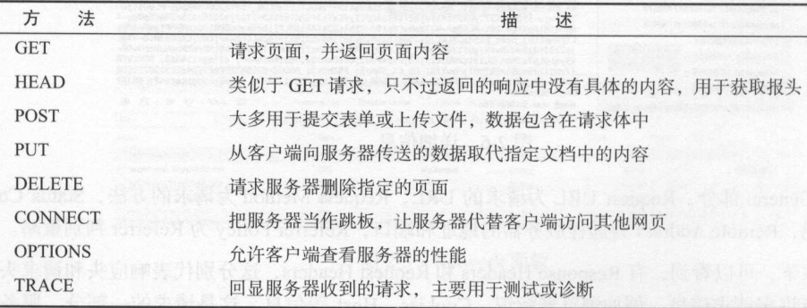
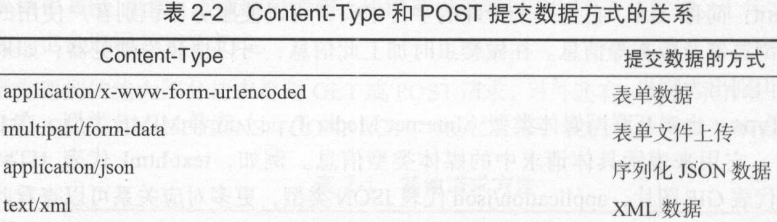
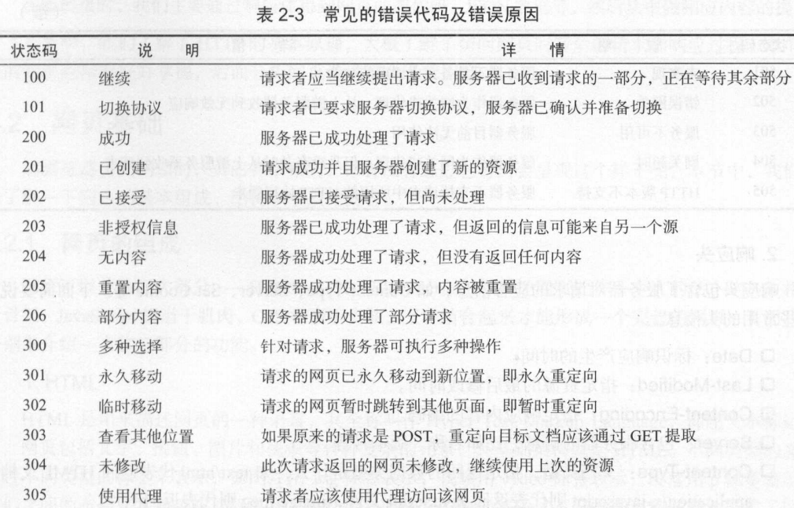
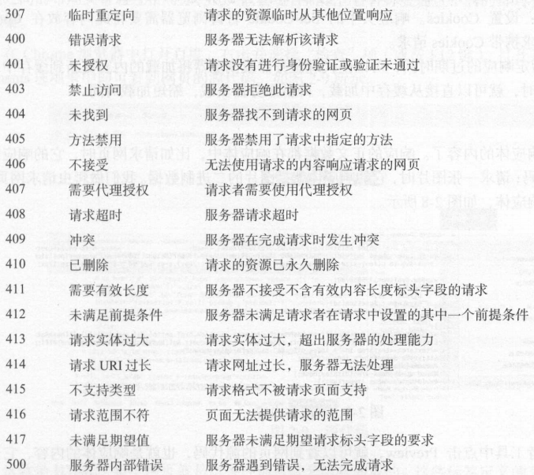
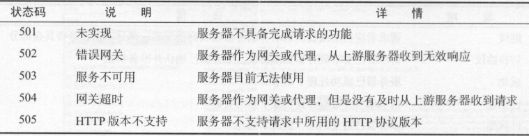

# http基本原理

## URI URL
* URI 全称为Uniform Resource Identifier 统一资源标志符
ssssssss
* URL 全称为 Universal Resource Locator 统一资源定位符
    * 例如 https://github.com/favicon.ico是github的网站图标链接，他是一个URL，也是一个URI。我们用URL/URI唯一指定了他的访问方式，包括(访问协议://访问路径/资源名)，通过这个链接我们能够从互联网上找到这个资源，这就是URL/URI
    * 但是URL是URI的子集，URI还包括一个子类叫做URN(Universal Resource Name)统一资源名称(只命名名称，不指定如何定位资源)，例如书籍urn:isbn:0451450523指定了一本书的ISBN，可以唯一标识这本书，但不指定到哪里定位这本书
    
## 超文本(hypertext)
* 在浏览器中看到的网页就是超文本解析而成的，其实网页源码就是一系列的HTML代码，里面包含了一系列的标签，。。

## HTTP 和 HTTPS
* URL开头会有http或https，这就是访问资源需要的协议类型。ftp,sftp,smb.都是协议类型。(http、https)
* HTTP(Hyper Text Transfer Protocol)超文本传输协议，用于从网络传输超文本数据到本地浏览器的传送协议，
* HTTP(Hyper Text Transfer Protocol over Secure Socket Layer)http协议的安全版，HTTP下面加入ssl层。
    * 建立一个信息安全通道来保证数据传输的安全
    * 确认网站真实性，凡事使用https的网站，都可以查看网站认证的真实信息，也可以通过CA机构颁发的安全签章来查询
    * 某些网站虽然使用了HTTPS协议，但还是会被浏览器提示不安全，例如12306的CA证书是中国铁道部自行签发的，而这个证书是不被CA机构信任的。所以这里证书验证就不会通过

## HTTP请求过程
我们在浏览器中输入一个URL，回车后便会在浏览器中观察到页面内容。实际上，这个过程是浏览器向网站所在的服务器发送了一个请求，服务器接受请求后处理和解析，然后返回响应，浏览器在进行解析

### Chrome 审查项
1. name 请求的名称，一般将URL最后一部分当做名称
2. status 响应状态码，显示为200，代表正常。
3. Type 文件类型，document为HTML文档
4. initiator 请求源，用来标由哪一个对象或进程发起
5. size 从服务器下载的文件和请求的资源大小。从缓存会显示from cache
6. time 发起请求到响应的时间
7. waterfall 可视化瀑布流

### 详细请求响应消息
* General(adj. 一般的 普通的 综合的)
    * Request URL 
        * 请求的URL
    * Request Method
        * 请求的方法
    * Status Code
        * 响应状态码
    * Remote Address 
        * 远程服务器的地址和端口
    * Referrer Policy
        * Referrer判别策略
* Response Headers(响应头)
    * 各种响应信息
    * 服务器的类型
    * 文档类型
    * 日期
* Request Headers(请求头)
    * 各种请求信息
    * 浏览器标识
    * Cookies
    * Host

## 请求
* 由客户端向服务端发出可以分为4部分内容:
    * 请求方法(Request Method)
    * 请求的网址(Request URL)
    * 请求头(Request Headers)
    * 请求体(Request Body)
* 详细解释
    1. 请求方法(常见为get和post) 
        * 在浏览器中直接输如URL回车，就发起了一个GET请求，请求参数会直接包含到URL中
        * post请求大多数在表单提交时发起
        * post & get请求方法的区别
            1. GET请求的参数包含在URL中，数据可以在URL中看到，而POST请求的 不会包含这些数据，数据都是通过表单形式传输的，会包含在请求体中
            2. Get请求提交的数据最多只有1024个字节，post没有限制
        * 一般登录时需要传送用户名密码会使用post请求传输，上传文件时，由于文件过大，也会使用post方式上传
        * 请求方式详解
        
        
    
    2. 请求的网址
        * 请求的网址，即统一资源定位符URL，他可以唯一的确定我们想要的资源
    
    3. 请求头
    * 用于说明服务器要是用的附加信息，比较重要的有Cookie、Referer、User-Agent等等
    * 详细信息
        1. Accept
            * 请求报文域，用于指定服务器可以接受哪些类型的信息
        2. Accetp-Language
            * 指定客户端可以接受的语言类型
        3. Accept-Encoding
            * 指定客户端可接受的内容编码
        4. Host
            * 用于指定请求资源的主机IP和端口号，其内容为请求URL的原始服务器或网关的位置。
        5. Cookie
            * 用于辨别用户进行会话跟踪而存储在用户本地的数据，用于维持当前的访问会话。
            * 例如我们登录一个网站之后，服务器会使用会话保存登录状态和信息，后面我们每次刷新或者请求该站点的其他页面时，都会发现是登录状态，这就是cookies的功劳。cookies里有信息标标识了我们所对应的服务器的会话，每次浏览器在请求该站点时，都会在请求头中加上Cookies并将其发送给服务器，服务器通过cookies识别出我们自己，查看登录状态，所以返回登录之后才能看到的页面
        6. Referer
            * 用于标识这个请求从哪个页面发过来，服务器可以拿到这一信息并做相应处理，来源统计、防盗链
        7. User-Agent
            * 是一个特殊的字符串头，可以是服务器识别客户使用的操作系统版本，浏览器及版本信息，加上此信息可以伪装为浏览器     8. Content-Type 
            * 也叫作互联网媒体类型(Internet Media Type)或者叫做MIME类型，在http协议中，用来表示具体请求中的媒体类型信息，。
        * 请求头是很重要的组成部分，编写爬虫，大部分情况下都需要设点请求头
        
    4. 请求体
        * 一般用来承载的内容时POST请求中的表单数据，对于GET而言，请求体为空
        * 登录时，我们填写用户名和密码信息，提交时这些内容就会以表单的数据的形式提交给服务器，此时注意Request Headers中指定Content-Type为application/x-www-form-urlencoded,才会以表单数据的形式提交。
        
            

## 响应
* 响应，由服务端返回给客户端，可以分为三个部分：响应状态码(Response Status Code)、响应头(Response Headers)、响应体(Response Body).

1. 响应状态码
    * 响应状态码表示服务器的响应状态，如200表示服务器正常响应，404表示资源未找到，500表示服务器内部发生错误。
        
        * 
        * 
        * 

2. 响应头
* 响应头中包含了服务器对于请求的应答消息，如Content-Typt、Server、Set-Cookie等等
* 详解
    1. Date
        * 标识响应产生的时间
    2. Last-Modified
        * 指定资源的最后修改时间
    3. Content-Encoding
        * 指定响应内容的编码
    4. Server
        * 服务器的信息，名称，版本号
    5. Content-Type
        * 文档类型，
            1. text/html ->html文档
            2. application/x-javascript ->javascript文件
            3. image/jpeg表示返回图片
    6. Set-Cookie
        * 设置Cookies.响应头中的Set-Cookie告诉浏览器需要将次内容放在Cookies中，下次请求时携带
    7. Expires
        * 指定响应的过期时间，可以使代理服务器或浏览器将加载的内容更新到缓存中，下次访问从缓存加载，降低服务器负载
        
3. 响应体
    * 最重要的内容要属于响应体了。相应的正文数据都是在响应体中的，比如请求网页时，他的响应体就是网页的HTML代码，请求一张图片，他的响应体就是图片的二进制数据
    
    * 爬虫主要是通过响应体得到网页的源代码，json数据，然后从中做相应的内容提取

